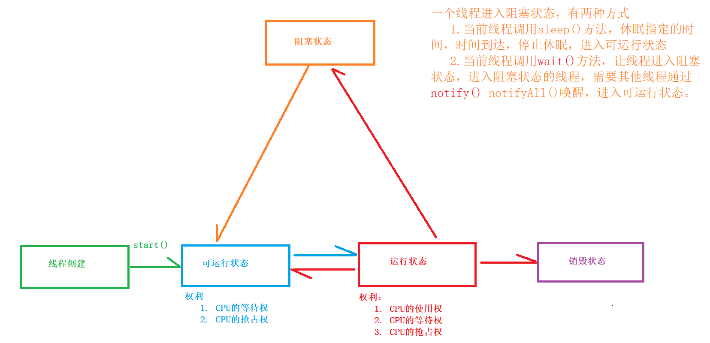
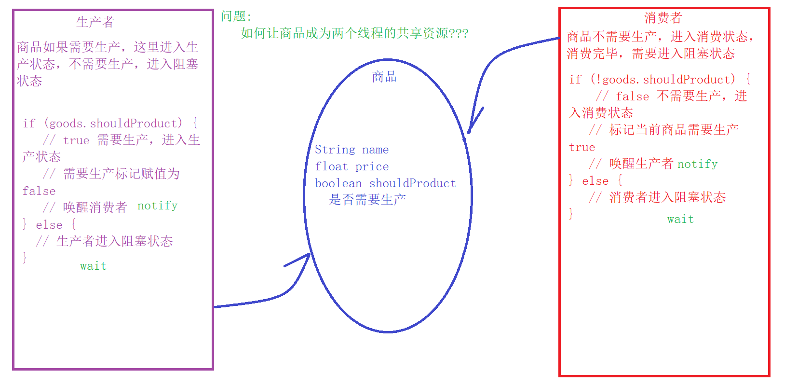

# Date

#### 1.Date

```java
Date封装的是系统的当前时间，但是Date已经过时了，sun建议使用Calendar类
Date date = new Date();
Calendar calendar = Calendar.getInstance();
	    int year = calendar.get(Calendar.YEAR);
        int month = calendar.get(Calendar.MONTH) + 1;//月份要加1
        int day = calendar.get(Calendar.DAY_OF_MONTH);
        int dayOfWork = calendar.get(Calendar.DAY_OF_WEEK);
        int hour = calendar.get(Calendar.HOUR_OF_DAY);
        int minute = calendar.get(Calendar.MINUTE);
        int second = calendar.get(Calendar.SECOND);

SimpleDateFormat sf = new SimpleDateFormat("YYYY-MM-dd HH:mm:ss");
String format = sf.format(new Date(file.lastModified()));
System.out.println(format);
```

# Math

#### 1.Math

```java
static double ceil(double a);//返回大于等于指定小数的最小整数
static double floor(double a);//返回小于等于指定小数的最大整数
static long round(double a);//四舍五入
static long double random();//返回大于0.0小于1.0的小数
```

# 进程和线程

#### 1.什么是进程

```
就是一个独立的应用程序
	进程都是需要通过系统的分配，获取系统当中CPU，内存，显卡，网络和磁盘的这些资源。
	1. 独立性
	2. 互斥性
```

#### 2.什么是线程

```
进程是由多个线程组成的，而且最少有一个线程
	线程就是进程中的一个功能	
	1. 抢占式运行！！！
		CPU执行程序是按照时间片的形式来执行的，而且单位时间片不能的线程相互抢占执行
	2. 资源共享性！！！
		一个程序内的线程，是共享当前程序的资源，CPU，内存

你认为一个Java程序在运行的时候，最少有几个线程???
两个：
	main线程，主方法
	JVM垃圾回收机制
```

#### 3.进程和线程的区别

```
进程是一个完成的程序，我们这里可以看做是一个生产车间
线程是一个程序中某一个功能，可以认为是生产车间中的一条生产线

生产车间是由多条生产线组成的，程序也是由多个线程组成的！！！

进程申请的是系统资源
线程申请的是进程资源
	动态申请的！！！
```

#### 4. 线程的优缺点

```
物极必反！！！
优势:
	1. 提高资源的利用率，CPU 内存
	2. 可以电脑可以同时执行多个功能，提高工作效率
	3. 提升用户体验
劣势:
	1. 加重CPU 内存负担
	2. 降低CPU执行其他线程的概率，用户会体验卡顿
	3. 共享资源问题【重点】
	4. 死锁 【避免】
```

#### 5.创建自定义线程的两种方式

```java
Thread是线程的基类！！！
方式1：
	自定义线程类，继承 extends Thread类，重写run方法

Runnable是所有线程代码必须遵从的接口！！！
方式2：
	自定义线程类，遵从 Runnable接口，实现 run 方法
	what will be run

[推荐方式]:
	使用方式2，Java中的继承是单线继承，一个类只允许继承一个父类，如果一个类继承了Thread类，就无法在继承其他类，但是接口，可以实现很多个！！！
```

#### 6.线程中的常用方法

```java
Thread类中成员方法:

构造方法 Constructor
	Thread();
		创建一个Thread线程类对象，没有指定的目标代码和线程名
	Thread(Runnable target);
		创建一个Thread线程类对象，传入参数是一个Runnable接口的实现类对象，target是Thread类执行
		线程程序，没有约束线程名
	Thread(Runnable target, String name);
		创建一个Thread线程类对象，传入参数是一个Runnable接口的实现类对象，target是Thread类执行
		线程程序，并且约束线程的名字为name

成员方法：
	void setName(String name);
		设置线程的名字
	String getName();
		获取当前线程的名
	void setPriority(int newPriority);
		设置线程的优先级，优先级只能增加当前线程的执行概率，不能确定一定执行他
		线程优先级默认为5 1 ~ 10 10 最高 1最低
	int getPriority();	
		获取当前线程的优先级

类方法 static修饰的方法：
	static Thread currentThread();
		该方法在哪里执行，就是获取哪里的线程类对象！！！
	static void sleep(int ms);
		让当前线程休眠指定的毫秒数
```

#### 7.同步代码块

```java
用来处理共享资源问题
例如：
	ATM机，一个人在办理业务时，里面锁门之后其他人需要排队。

电影院 IMAX 电影
	<<复仇者联盟4>> 100张
	网络，线下
	网络: 淘票票，猫眼，美团
	
	这里有三种订票方式，需要同时销售这100张票，100张票是这三个销售渠道的共享资源。
	每一个销售渠道都是一个线程。

问题1:
	这100张票应该如何保存，选择什么类型的数据
	int类型
	成员变量:
		这里会创建三个销售线程类对象，如果ticket是一个成员变量，在每一个销售线程里都有一个自己的
		【成员变量】Ticket，这样的Ticket不是共享资源，相互不干扰。
		pass！！！
	局部变量:
		定义在方法内，只能定义在run方法内，运行一次run，ticket重新定义，运行完毕，销毁，没有任何
		的可持续性，不能使用
		pass！！！
	类变量:
		静态成员变量，保存在内存的数据区，可以提供给所有的当前类对象使用，而且是一处修改，处处受影
		响。一个不错的选择
		bingo！！！

问题2:
	1. 存在一张票卖出3次的情况。
	2. 售票顺序有点混乱。

解决方案:
	同步代码块
	synchronize (/* 锁对象 */) {
		// 加锁的代码
	}
	
	1. 在同步代码块内。有且只允许一个线程执行
	2. 锁对象可以是任意类型的对象，但是要求必须是同一个对象
	3. 同步代码块包含的代码越少越好
	4. Thread.sleep()不会开启锁对象！！！
```

#### 8  守护线程 [后台线程]

```
一些程序的后台线程：
	软件自动更新
	软件中的日志记录
	系统的服务检测

守护线程或者后台线程有一个要求
	如果程序中有且只有一个守护线程之后，会自动退出
```

#### 9.线程声明周期



##### 9.1  wait() 和 notify() 方法

```java
wait()和notify()方法都是Object类中的方法

wait()
	1. 让调用该方法的线程进入一个阻塞状态
	2. 需要通过对象调用，而且一般都是【锁对象】
	3. 【线程进入阻塞状态，会解锁当前使用的锁对象】

notify()
	1. 获取一个线程
	2. 也是需要通过对象调用，而且一般都是【锁对象】
	3. 【唤醒其他线程，并且解锁锁对象】
```

##### 9.2 生产者和消费者【线程通信】

```
匹克 态极

生产者是 Peak 匹克
消费者是 wo
	
	消费者需要购买，结果没货，我需要进入等待状态。
	生产者进入生产状态，匹克开始加班加点！！！
	生产好了，告知消费者可以购买，给我发货
	我进入准备收货状态。
```

##### 9.3 生产者消费者图例



##### 9.4 需要解决的问题

```
1. 如何让商品成为两个线程的共享资源
	创建商品类对象，在消费者和生产者中定义一个成员变量，同时保存商品类对象的空间首地址，这里可以使用构造方法来完成。使用同一个对象保存的地址相同
	
2. 两个线程没有使用锁，会导致代码错乱，如何选择锁对象
	选择商品作为锁对象

3. 出现了死锁！！！！
	因为生产者进入生产状态之后，并没有从线程代码中运行结束处理，没有打开锁！！！

4. 使用notify和wait完成线程之间的通信
	这两个方法，都可以开锁！！！
```

