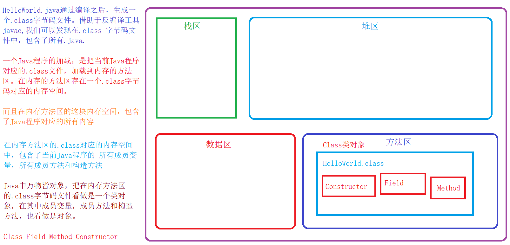
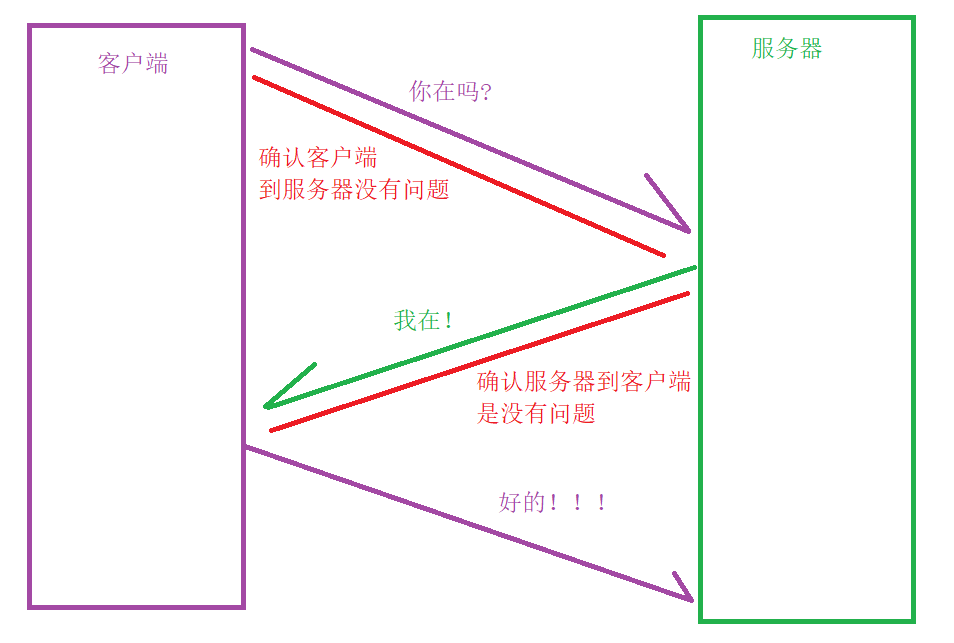

# 反射:框架的原理，形成中转站

#### 1.反射原理



#### 2.获取Class类对象

```java
//通过Class类名调用，是一个static方法，传入的参数是一个完整的包名，类名
static Class forName(String className);//最常用
 		ex:	demo--> com.hpy.a.demo1

//通过指定类名调用，获取类对应的属性
Class 类名.class 
  
//通过类对象，获取对应当前类对象的class，Class类对象
Class 类对象.getClass();
```

#### 3.获取Constructor类对象

```java
//获取类内所有非私有化构造方法Constructor数组
Constructor[] getConstructors();
//暴力反射,获取类内所有构造方法Constructor数组
Constructor[] getDeclaredConstructors();
/*根据指定类型，获取指定的非私有化构造方法类对象，Constructor
Class...首先这里要求的数据类型是Class类对象，而且当前参数不确定
可以不传入参数，也可以传入多个Class类型参数
initParameterType：指定的数据类型
*/
Constructor getConstructor(Class... initParameterType)
//根据指定的参数类型，获取指定的构造方法类对象，constructor
Constructor getDeclareConstructor(Class... initParameterType)  
  

// 通过Constructor类对象调用，传入的参数是当前构造方法，创建对象所需的实际参数
Object newInstance(Object...initParameter)
```

#### 4.获取Method类对象

```java
//获取当前所有类内的非私有化成员方法，包括父类继承而来的可以在子类使用的成员方法
Method[] getMethods();
//获取当前类内的所有方法，但不包括从父类继承而来的方法
Method[] getDeclaredMethods();
//获取类内的指定方法名和参数类型的非私有化方法
//methodName 指定的方法名字 Class...initParameterType当前方法的Class类对象，不定长
Method getMethod(String methodName,Class...initParameterType)
//获取类内的指定方法名和参数类型的所有方法，包括私有化
Method getDelaredMethod(String methodName,Class...initParameterType)
//Obejct obj 调用当前方法的类对象 args执行当前方法的需要的实际参数
Object invoke(Object obj,Object...args)
 
```

#### 5.获取Field类对象

```java
//获取当前类对象的所有非私有化的成员变量，返回的是一个Field类型数组
Field[] getFields()
//获取当前类对象的所有的成员变量
Field[] getDeclaredFields()
//通过成员变量的名字获取成员变量（非私有化
Field getFeild(String fieldName);
//通过成员变量的名字获取成员变量（私有也可以
Field getDeclaredFeild(String fieldName);

void set(Object obj,Object value)
  
Object get(Object obj)
```


#### 给予暴力反射操作权限

```java
//暴力反射获取的内容，默认情况下类外没有权限，如果低啊用当前方法，传入参数为true 
void setAccessible(boolean) 
```

# 单例模式

#### 1.单例

```java
需求：
  	要求当前类对象在整个程序运行过程中，有且只有一个类对象。
如何获取类对象：
  new 一个
问题：
  通过new关键字和构造方法，创建的对象都是新的对象
  
写个公告：
  这个对象我new过了，你们不能new了
  class SingleDog{
    private SingleDog(){}
    /*
    成员方法如何写：
        1.类外可以使用：public
        2.没有对象只能用用类名调用方法：static
        3.当前方法需要返回值：SingleDog
        4.方法名：getInstance
        5.形式参数列表：null
     */
    private static SingleDog sd = null;
    public static SingleDog getInstance(){
        synchronized (SingleDog.class){
            if (null == sd){
                sd = new SingleDog();
            }
        }
        return sd;
    }

}
```

# IP,TCP,UDP

#### 1.IP

```
网络编程
			解决计算机和计算机之间的通信问题，PC，手机，Ipad,手表，摄像头，QQ聊天
网页编程
			基于html页面基础之上，给予数据的展示和用户的交互，数据的传递，jd taobao
计算机网络：
			各种各样的计算机，相互之间通过网络传输协议，完成一个交互的信息网络
IP地址：
			计算机在网络世界的唯一地址
			IPV4 32个二进制位组成的 
			IPV6 :让地球上的每一粒沙子都有Ip地址
			127.0.0.1 是IP地址的底层映射 0.0.0.0-255.255.255.255
InetAddress类
Java中提供了一个操作IP地址的类对象。
	InetAddress
	InetAddress.getLoaclhost();
	InetAddress.getByName();
	InetAddress.getAllByName();
	InetAddress.getHostByName();
```

#### 2.UDP

```
Socket 套接字
		 在网络传输中一个非常重要的协议，需要在不同的计算机上安装有Socket这些计算机才可以完成借助网络的信息传递
协议：
		IEEE
		
UDP协议下的socket：
	1. 是按照数据包的方式来处理数据，面向无连接。
	2. 每一个数据包有大小限制，要求在64KB以内！
	3. 因为面向无连接，所有传输数据不安全，不稳定
	4. 因为面向无连接，所有传输速度贼快
	5. UDP不区分客户端和服务器，只有发送端和接收端
	
UDP下的socket:
	DatagramSocket();
		UDP协议下的Socket
	DatagramPacket(byte[] buff, int length, InetAddress ip, int port);
		UDP协议下的数据表方方法
		buff: 数据内容，要求是一个byte类型数组
		length: 发送的byte类型数组的字节的长度
		ip: 接收人的IP类对象
		port: 端口号
			总端口号 0 ~ 65535
			0 ~ 1023 不能使用，因为绑定系统服务
			剩余的随便用！！！ 10000+++
			Tomcat 8080
	
	send 
	receive 

数据丢失的原因:
	1. 带宽不够
	2. 电脑处理能力不足
```


#### 3.TCP

```
TCP特征:
	1. TCP协议是完全依赖IO流的，面向连接的！！！
	2. 数据传输没有大小限制
	3. 因为面向连接，所以数据安全
	4. 因为面向连接，所以速度较慢
	5. TCP协议严格区别客户端和服务器

TCP协议的三次握手
```



```
建立TCP的过程
	1. 获取TCP协议的Socket
		Socket 客户端: 这里需要服务器的IP地址和端口号
		ServerSocket 服务器: 确定端口号即可
	2. 获取对应的【IO流对象】对象
		InputStream
		OutputStream
	3. 处理数据，读取(receive)或者写入(send);
	4. 关闭Scoket
```

