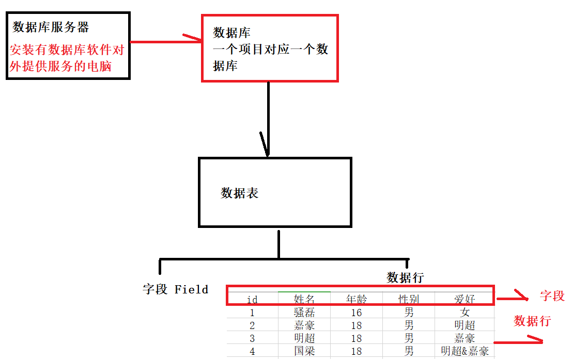

# 普适性排序算法

```java
/**
*使用自定义泛型，和Comparator接口作为比较方式约束的一个普适性排序算法
*
*@param arr T类型的数组，可以是任意类型，而且该数组的数据类型用于约束当前方法的泛型对应具体数*据类型
@param com comparator 接口实现类对象，而且受到泛型约束，泛型对应具体数据类型，根据第一个参数*类型t决定
*/
public static<T> void selectSort(T[] arr , Comparator<T> com){
    if(null == arr || arr.length == 0 || null = com){
        throw new NullPointException();
    }
    for(int i = 0 ; i < arr.length - 1;i++){
        int index = i;
        for (int j = i + 1; j< arr.length ,j++){
            if(com.compare(arr[index],arr[i]) > 0){
                index = j;
            }
        }
        if(index != i){
            T temp = arr[index];
            arr[index] = arr[i];
            arr[i] = temp;
        }
    }
}
```

## MySQL Day01

#### 1. MySQL 安装过程

##### 详见Windows下安装MySQL 5.7 压缩版

#### 2. 什么是数据库

```
数据库软件:
	关系型: MySQL SQL Server Oracle sqlite
	非关系型：Redis MemoryCache 热数据处理
```



#### 3. SQL语句分类

```
SQL 结构化查询语句 通用于所有的数据库

DDL: 数据定义 
DML: 数据处理
DTL: 事务处理，回滚
DQL: 数据查询
DCL: 数据控制，权限控制 DBA
```

#### 4. 通过命令操作MySQL数据库

```mysql
# 连接数据库
cmd > mysql -hlocalhost -uroot -p123456
# mysql 表示告知计算机，这里启动的是哪一个软件
# -hlocalhost h host 主机 localhost 本地电脑 127.0.0.1 因为是本机可以省略
# -uroot u user 用户 root 当前数据库的默认用户
# -p123456 p password

# 推荐使用方式
cmd > mysql -uroot -p
Enter password: ******

# 当前数据库服务器中的所有数据库有哪些
mysql > show databases;

# 创建一个数据库
mysql > create database javaee1904;

# 删除数据库
mysql > drop database javaee1904;
 
# 选择使用数据库 所有对于数据表的操作都是在javaee1904数据库下
mysql > use javaee1904;

# 展示当前数据库下的所有数据表
mysql > show tables;

# 创建一个数据表
mysql > create table person(
    # 字段名 数据类型
    id int,
    # name字段，使用的数据类型是可变长的字符串，最大长度是30个字符 
    name varchar(30),
    # age字段 tinyint ==> Java byte 0 ~ 255 
    age tinyint,
    # info字段 text是文本字段
    info text    
);

# 看一下当前的表结构
mysql > desc person;
+-------+-------------+------+-----+---------+-------+
| Field | Type        | Null | Key | Default | Extra |
+-------+-------------+------+-----+---------+-------+
| id    | int(11)     | YES  |     | NULL    |       |
| name  | varchar(30) | YES  |     | NULL    |       |
| age   | tinyint(4)  | YES  |     | NULL    |       |
| info  | text        | YES  |     | NULL    |       |
+-------+-------------+------+-----+---------+-------+

# 查看数据库的创建过程 [了解]
mysql > show create database javaee1904;
+------------+---------------------------------------------------------------------+
| Database   | Create Database                                                     |
+------------+---------------------------------------------------------------------+
| javaee1904 | CREATE DATABASE `javaee1904` /*!40100 DEFAULT CHARACTER SET utf8 */ |
+------------+---------------------------------------------------------------------+

# 查看数据表的创建过程 [了解]
mysql > show create table person;

# 创建数据库表修改对应的存储引擎和字符集 [了解]
mysql > create table test1(id int) engine=myisam default charset=gbk;

# 退出数据
mysql > exit;
mysql > quit;
# 【禁止 重点】在cmd中，使用右上角叉号关闭数据库
```

#### 5. 修改表 alter

```mysql
# 看一下当前的表结构
mysql > desc person;
+-------+-------------+------+-----+---------+-------+
| Field | Type        | Null | Key | Default | Extra |
+-------+-------------+------+-----+---------+-------+
| id    | int(11)     | YES  |     | NULL    |       |
| name  | varchar(30) | YES  |     | NULL    |       |
| age   | tinyint(4)  | YES  |     | NULL    |       |
| info  | text        | YES  |     | NULL    |       |
+-------+-------------+------+-----+---------+-------+

# 删除字段 
alter table person drop info;

# 添加字段，性别，使用数据类型为tinyint，第一 够用， 第二 节省空间
mysql > alter table person add gender tinyint;

# 在指定字段之后添加其他字段
mysql > alter table person drop gender;
# 在name 字段之后添加新的字段
mysql > alter table person add gender tinyint after name;

# 修改指定字段的数据类型
mysql > alter table person modify name char(30);

# 修改指定字段的名字和数据类型
mysql > alter table person change gender sex boolean;

# 添加新字段 
# float(8, 2)
# 该数据最大长度为8，最多小数位为2 999999.99
mysql > alter table person add salary float(8, 2);
mysql > alter table person add info text;

```

#### 6. 插入数据 insert

```mysql
mysql> desc person;
+--------+------------+------+-----+---------+-------+
| Field  | Type       | Null | Key | Default | Extra |
+--------+------------+------+-----+---------+-------+
| id     | int(11)    | YES  |     | NULL    |       |
| name   | char(30)   | YES  |     | NULL    |       |
| sex    | tinyint(1) | YES  |     | NULL    |       |
| age    | tinyint(4) | YES  |     | NULL    |       |
| salary | float(8,2) | YES  |     | NULL    |       |
| info   | text       | YES  |     | NULL    |       |
+--------+------------+------+-----+---------+-------+
mysql > create table person(
    id int,
    name char(30),
    sex boolean,
    age tinyint,
    salary float(8, 2),
    info text
);
-- 规规矩矩插入数据
mysql > insert into person(id, name, sex, age, salary, info) values(1, "骚磊", 0, 16, 20, "曾想仗剑走天涯，没想后来遇见Java");

-- 指定数据插入
mysql > insert into person(id, name, sex, age, info) values(2, "骚杰", 0, 66, "自带生化武器");

-- 按照字段顺序，整体插入数据
mysql > insert into person values(3, "骚熊", 0, 56, 10.05, "鼾声震天响");

insert into person(id, name, sex, age, salary, info) values(4, "孙红雷", 0, 40, 100, "颜王"); 
insert into person(id, name, sex, age, salary, info) values(5, "吴京", 0, 45, 1000, "硬汉"); 
insert into person(id, name, sex, age, salary, info) values(6, "黄渤", 0, 50, 210, "影帝"); 
insert into person(id, name, sex, age, salary, info) values(7, "徐峥", 0, 55, 110, "油腻"); 
insert into person(id, name, sex, age, salary, info) values(8, "王宝强", 0, 42, 310, "辛巴"); 
insert into person(id, name, sex, age, salary, info) values(9, "成龙", 0, 68, 199999, "大哥"); 
insert into person(id, name, sex, age, salary, info) values(10, "姚明", 0, 35, 20000, "巨人"); 
insert into person(id, name, sex, age, salary, info) values(11, "彭于晏", 0, 16, 9, "型男"); 
insert into person(id, name, sex, age, salary, info) values(12, "胡歌", 0, 18, 15, "帅就完了"); 
insert into person(id, name, sex, age, salary, info) values(13, "吴彦祖", 0, 16, 7, "真帅"); 
insert into person(id, name, sex, age, salary, info) values(14, "靳东", 0, 25, 11, "男神"); 
insert into person(id, name, sex, age, salary, info) values(15, "王凯", 0, 30, 1000, "男神他弟"); 
insert into person(id, name, sex, age, salary, info) values(16, "刘德华", 0, 62, 20000, "天王"); 
insert into person(id, name, sex, age, salary, info) values(17, "郭德纲", 0, 52, 1, "流氓头子"); 
insert into person(id, name, sex, age, salary, info) values(18, "迪丽热巴", 1, 27, 10, "美女！！！"); 
insert into person(id, name, sex, age, salary, info) values(19, "王鸥", 1, 30, 20, "霸道女总裁"); 
insert into person(id, name, sex, age, salary, info) values(20, "杨紫", 1, 26, 1, "夏雪"); 

```

#### 7. 修改数据【慎用】

```mysql
-- update 
-- 修改数据时如果没有任何的条件约束，所有数据都被修改！！！
-- 如果没有开启事务。该操作不可以逆转
mysql > update person set name = "航海中路彭于晏"; -- 不允许的操作，影响所有数据

-- 通过一些条件来约束数据
mysql > update person set name = "航海中路郭达斯坦森" where id = 1;
```

#### 8. 删除数据【慎用】

```mysql
-- delete 
-- 删除数据没有任何的约束吗，整个数据表都没有了！！！
mysql > delete from person;

-- 通过一些条件来约束删除的数据行到底有哪些
mysql > delete from person where id = 10;
mysql > delete from person where sex = 0;
```

#### 9. 事务处理

```mysql
-- 保证数据操作的一个安全性，一般用于在数据修改，删除，添加时
-- 关闭自动提交
mysql > set autocommit = 0;

-- 确认数据无误 提交在set autocommit 之后的所有SQL语句
mysql > commit;

-- 操作存在问题，回滚到set autocommit位置
mysql > rollback;
```

#### 10. 查询数据【非常重要】

```mysql
-- select
-- 一个在开发中不允许使用的查询语句
-- 会展示当前数据库中的所有数据，严重拖慢数据库的效率
mysql > select * from person;

-- 按照字段查询
-- 会按照SQL语句指定的字段，生成一个对应的结果集！！！
mysql > select id, name from person;
mysql > select name, id from person;
mysql > select id, name, info from person;

-- 可以按照字段查询，另外给字段起一个别名
mysql > select id as "编号", name as "姓名", info as "信息" from person;

-- 可以使用最基本的条件
-- > < >= <= != <> =
mysql > select * from person where age >= 30;
mysql > select * from person where age != 52;
mysql > select * from person where id = 1;

-- 可以使用逻辑运算符
-- 与 and 或 or
mysql > select * from person where age > 30 and salary > 40;
mysql > select * from person where age > 30 or salary > 10;

-- 排序 
-- order by 
-- asc 升序 desc 降序
mysql > select id, name, age from person order by age asc;
mysql > select id, name, age from person order by age desc;
mysql > select id, name, age, salary from person order by age desc;

-- 按照年龄降序排序，如果年龄有相同情况，使用工资的升序
mysql > select id, name, age, salary from person order by age desc, salary asc;

-- 分页查询 [重点]
-- 在页面上展示的数据结果不可能给用户一次性展示完毕
-- 按照用户要求的展示数据行数展示，然后其他的分页
-- limit
mysql > select * from person limit 0, 5;
mysql > select * from person limit 5, 5;
mysql > select * from person limit 10, 5;
mysql > select * from person limit 15, 5;
-- limit 从下标指定位置开始, 指定的数据行数
-- pageCount 表示当前页码 length 表示当前展示多少行数据
-- limit (pageCount - 1) * length, length;

-- 内置函数 最好别用
-- 也会拖慢MySQL数据库效率问题
mysql > select max(age) from person;
mysql > select min(age) from person;
mysql > select avg(age) from person;
mysql > select sum(age) from person;
mysql > select count(*) from person;
mysql > select count(1) from person; -- 据说 这个效率比 count(*) 高一点

-- 模糊查询
-- 大量使用在搜索情况下！！！
-- like 
-- % 不限制匹配字符个数 
-- _ 必须匹配一个！！！
mysql > select * from person where name like "骚_";
mysql > select * from person where name like "_骚_";
mysql > select * from person where name like "_骚";
mysql > select * from person where info like "男_";
mysql > select * from person where info like "%男%";

-- 分组 group by
-- 1. 按照性别分组
mysql > select sex as "性别", count(1) from person group by sex;

-- 2. 按照性别分组，找出人数大于5的那一组
mysql > select sex, count(1)  -- 查什么
from person  -- 从哪里查
group by sex -- 如何分组
having count(1) > 5; -- 分组之后的条件是什么，这里使用having

-- 3. 找出年龄大于20的，按照性别分组，找出人数大于3的组
mysql > select sex, count(1) -- 查什么
from person -- 从哪里
where age > 20 -- 分组之前什么条件
group by sex -- 按照什么分组
having count(1) > 3; -- 分组之后的条件
```

## MySQL Day02

#### 1. 数据约束【重点】

##### 1.1 默认值

```mysql
-- 用户在插入数据时，如果没有给予当前字段一个数据，当前字段会按照设置的默认值处理
-- default
mysql > create table person1(
    id int,
    name varchar(30),
    country char(20) default "PRC"
);
+---------+-------------+------+-----+---------+-------+
| Field   | Type        | Null | Key | Default | Extra |
+---------+-------------+------+-----+---------+-------+
| id      | int(11)     | YES  |     | NULL    |       |
| name    | varchar(30) | YES  |     | NULL    |       |
| country | char(20)    | YES  |     | PRC     |       |
+---------+-------------+------+-----+---------+-------+

mysql > insert into person1(id, name) values(1, "骚磊");
mysql > insert into person1(id, name, country) values(2, "骚杰", "中华人民共和国");
```

##### 1.2 非空

```mysql
-- not null
-- 指定字段的数据必须有内容，不能为空！！！
mysql > create table person2(
    id int not null, -- 该字段不能为空
    name varchar(30),
    info text
);

+-------+-------------+------+-----+---------+-------+
| Field | Type        | Null | Key | Default | Extra |
+-------+-------------+------+-----+---------+-------+
| id    | int(11)     | NO   |     | NULL    |       |
| name  | varchar(30) | YES  |     | NULL    |       |
| info  | text        | YES  |     | NULL    |       |
+-------+-------------+------+-----+---------+-------+

mysql > insert into person2(id, name, info) values(1, "吴彦祖", "香港第一帅");

mysql > insert into person2(name, info) values("航海中路彭于晏", "本宝宝！！！");
-- ERROR 1364 (HY000): Field 'id' doesn't have a default value
mysql > insert into person2(id, name, info) values(null, "航海中路彭于晏", "本宝宝！！！");
-- ERROR 1048 (23000): Column 'id' cannot be null
```

##### 1.3 唯一

```mysql
-- 要求改数据的字段在当前数据表中不能重复
-- unique
mysql > create table person3(
    id int unique, -- 该字段不可以重复
    name varchar(20) not null,
    info text not null
);
+-------+-------------+------+-----+---------+-------+
| Field | Type        | Null | Key | Default | Extra |
+-------+-------------+------+-----+---------+-------+
| id    | int(11)     | YES  | UNI | NULL    |       |
| name  | varchar(20) | NO   |     | NULL    |       |
| info  | text        | NO   |     | NULL    |       |
+-------+-------------+------+-----+---------+-------+

mysql > insert into person3(id, name, info) values(1, "騒杰", "生化核武器");

mysql > insert into person3(id, name, info) values(1, "骚磊", "航海中路彭于晏");
-- ERROR 1062 (23000): Duplicate entry '1' for key 'id'

mysql > insert into person3(name, info) values("骚磊", "航海中路彭于晏");
mysql > insert into person3(name, info) values("翘臀", "航海中路郭德纲");
+------+--------+-----------------------+
| id   | name   | info                  |
+------+--------+-----------------------+
|    1 | 騒杰   | 生化核武器            |
| NULL | 骚磊   | 航海中路彭于晏        |
| NULL | 翘臀   | 航海中路郭德纲        |
+------+--------+-----------------------+
--  插入数据，两个数据行中id属性都是null，但是不会发生冲突，null不作为唯一值！！！
```

##### 1.4 主键【重点】

```mysql
-- 唯一和非空的组合！！！
-- primary key
-- 主键一般都是该数据行的唯一索引！！！
-- 1. 数据库设计中，一般会使用一个和业务逻辑无关的数据作为主键！！！
-- 2. 性别，年龄，地址.. 这些数据不能做为主键！！！
mysql > create table person4(
    id int primary key, -- 主键
    name varchar(20) not null,
    info text not null
);
+-------+-------------+------+-----+---------+-------+
| Field | Type        | Null | Key | Default | Extra |
+-------+-------------+------+-----+---------+-------+
| id    | int(11)     | NO   | PRI | NULL    |       |
| name  | varchar(20) | NO   |     | NULL    |       |
| info  | text        | NO   |     | NULL    |       |
+-------+-------------+------+-----+---------+-------+

mysql > insert into person4(id, name, info) values(1, "骚磊", "一个和烤羊排过不去的男人");

mysql > insert into person4(id, name, info) values(1, "B44 AUG", "让我看到你，你已经没有了");
-- ERROR 1062 (23000): Duplicate entry '1' for key 'PRIMARY'
mysql > insert into person4(name, info) values("B31 MP5", "让你知道什么叫残忍");
-- ERROR 1364 (HY000): Field 'id' doesn't have a default value
```

##### 1.5 自增长

```mysql
-- 插入数据时，有些字段可以自动增长！！！
-- auto_increment
-- 使用auto_increment字段，首先是一个整数类型，另外必须是一个key(键)，一般都是主键
mysql > create table person5(
    id int primary key auto_increment, -- 主键，唯一索引，自增长
    name varchar(20) not null,
   	reg timestamp default current_timestamp -- 默认 
);

+-------+-------------+------+-----+-------------------+----------------+
| Field | Type        | Null | Key | Default           | Extra          |
+-------+-------------+------+-----+-------------------+----------------+
| id    | int(11)     | NO   | PRI | NULL              | auto_increment |
| name  | varchar(20) | NO   |     | NULL              |                |
| reg   | timestamp   | YES  |     | CURRENT_TIMESTAMP |                |
+-------+-------------+------+-----+-------------------+----------------+

mysql > insert into person5(name) values("骚磊");
mysql > insert into person5(name) values("航海中路彭于晏");
mysql > insert into person5(name) values("刘亦菲");

mysql > insert into person5(id, name) values(1, "骚杰");
-- ERROR 1062 (23000): Duplicate entry '1' for key 'PRIMARY'

mysql > insert into person5(id, name) values(6, "骚杰");
mysql > insert into person5(name) values("迪丽热巴");

mysql > insert into person5(id, name) values(4, "王鸥");
mysql > insert into person5(name) values("郭达斯坦森");

mysql > delete from person5;
mysql > insert into person5(name) values("郭德纲"); -- id 9

mysql > truncate person5;
mysql > insert into person5(name) values("孟鹤堂");

-- 自增长值受影响的情况:
-- 1. 自增长会随着数据的插入自动增长
-- 2. 如果插入数据字段中自增长字段数据大于当前的自增长，那么从插入数据位置开始自增长
--  		例如: id 自增长 5 插入数据id 为10 下一次数据 id 从 11 开始
-- 3. 自增长数据插入之前的值，不会影响当前自增长
-- 			例如: id 自增长 5 插入数据 id 为 3 下一次数据 id 从 6开始
-- 4. delete 数据不会影响自增长累加
-- 5. truncate 操作会把自增长值从1开始
```

##### 1.6 外键约束 [实际开发使用不多]

```mysql
-- 员工表
mysql > create table employee(
    id int primary key auto_increment, -- 主键，自增长
    empName varchar(30) not null, 
    deptName varchar(30) not null, 
    regTime timestamp default current_timestamp
);
+----------+-------------+------+-----+-------------------+----------------+
| Field    | Type        | Null | Key | Default           | Extra          |
+----------+-------------+------+-----+-------------------+----------------+
| id       | int(11)     | NO   | PRI | NULL              | auto_increment |
| empName  | varchar(30) | NO   |     | NULL              |                |
| deptName | varchar(30) | NO   |     | NULL              |                |
| regTime  | timestamp   | YES  |     | CURRENT_TIMESTAMP |                |
+----------+-------------+------+-----+-------------------+----------------+

mysql > insert into employee(empName, deptName) values("骚磊", "骚");
mysql > insert into employee(empName, deptName) values("烧饼", "骚");
mysql > insert into employee(empName, deptName) values("张云雷", "帅");
mysql > insert into employee(empName, deptName) values("岳云鹏", "贱");
mysql > insert into employee(empName, deptName) values("孟鹤堂", "帅");
mysql > insert into employee(empName, deptName) values("郭麒麟", "帅");
mysql > insert into employee(empName, deptName) values("张鹤伦", "贱");

-- 采用当前的形式保存数据的部门，会导致一定的数据冗余！！！分表！！！
mysql > drop table employee;

-- 新建部门表 和 员工表
mysql > create table dept(
    id int primary key auto_increment, 
    deptName varchar(20) not null
);

mysql > create table employee(
    id int primary key auto_increment, 
    empName varchar(20) not null,
    deptId int not null
);

mysql > alter table employee add regTime timestamp default current_timestamp;

-- 首先需要插入部门表
mysql > insert into dept(deptName) values("骚");
mysql > insert into dept(deptName) values("帅");
mysql > insert into dept(deptName) values("贱");
mysql > insert into dept(deptName) values("辣眼睛");

-- 插入员工表数据
mysql > insert into employee(empName, deptId) values("骚磊", 1);
mysql > insert into employee(empName, deptId) values("孟鹤堂", 2);
mysql > insert into employee(empName, deptId) values("骚杰", 4);
mysql > insert into employee(empName, deptId) values("张鹤伦", 3);
mysql > insert into employee(empName, deptId) values("岳云鹏", 3);
mysql > insert into employee(empName, deptId) values("郭麒麟", 2);

-- 插入数据，但是部门不存在，照样可以！！！不符合业务逻辑
mysql > insert into employee(empName, deptId) values("吴彦祖", 6);

-- 删除部门，对应部门的员工依然存在！！！不符合业务逻辑
mysql > delete from dept where id = 1;

-- 这里需要使用外键约束！！！来约束这些不符合业务逻辑的操作！！！
mysql > drop table employee;
mysql > drop table dept;

-- 新建部门表 和 员工表
mysql > create table dept(
    id int primary key auto_increment, 
    deptName varchar(20) not null
);

mysql > create table employee(
    id int primary key auto_increment, 
    empName varchar(20) not null,
    deptId int not null,
    regTime timestamp default current_timestamp,
    -- 使用外键约束，让员工表中的deptId和部门表的Id外键约束
    -- fk_emp_dp 外键名！！！
    -- foreign key(deptId) 声明当前表中哪一个字段作为外键 deptId作为外键
    -- references dept(id) 外键连接的，或者说约束的是哪一张表中的哪一个字段 dept(id)
    constraint fk_emp_dp foreign key(deptId) references dept(id)
);

-- 首先需要插入部门表
mysql > insert into dept(deptName) values("骚");
mysql > insert into dept(deptName) values("帅");
mysql > insert into dept(deptName) values("贱");
mysql > insert into dept(deptName) values("辣眼睛");

-- 插入员工表数据
mysql > insert into employee(empName, deptId) values("骚磊", 1);
mysql > insert into employee(empName, deptId) values("孟鹤堂", 2);
mysql > insert into employee(empName, deptId) values("骚杰", 4);
mysql > insert into employee(empName, deptId) values("张鹤伦", 3);
mysql > insert into employee(empName, deptId) values("岳云鹏", 3);
mysql > insert into employee(empName, deptId) values("郭麒麟", 2);

mysql > insert into employee(empName, deptId) values("吴彦祖", 56);
-- ERROR 1452 (23000): Cannot add or update a child row: a foreign key constraint fails (`javaee1904`.`employee`, CONSTRAINT `fk_emp_dp` FOREIGN KEY (`deptId`) REFERENCES `dept` (`id`))
-- 在从表中添加数据或者修改，会和主表检查外键数据是否合理

mysql > delete from dept where id = 1;
-- ERROR 1451 (23000): Cannot delete or update a parent row: a foreign key constraint fails (`javaee1904`.`employee`, CONSTRAINT `fk_emp_dp` FOREIGN KEY (`deptId`) REFERENCES `dept` (`id`))
-- 在主表删除数据或者修改，会考虑从表中是否在使用主表数据，如果在使用无法处理

-- 外键约束之后会有以下特征：
-- 1. 先添加主表，在添加从表
-- 2. 先删除从表，在删除主表
-- 3. 先修改从表，在修改主表
-- 4. 使用外键约束之后，数据表会变成一坨！！！操作不太方便！！！
-- 级联操作！！！
```

##### 1.7 级联操作

```mysql
-- 使用外键的情况下，操作从表和主表都存在一定的问题！！！
-- 级联删除 on delete cascade
-- 级联修改 on update cascade

mysql > drop table employee;
mysql > drop table dept;

mysql > create table dept(
    id int primary key auto_increment,
    deptName varchar(20) not null
);

mysql > create table employee(
    id int primary key auto_increment, 
    empName varchar(20) not null,
    deptId int not null,
    regTime timestamp default current_timestamp,
    -- 使用外键约束，让员工表中的deptId和部门表的Id外键约束
    -- fk_emp_dp 外键名！！！
    -- foreign key(deptId) 声明当前表中哪一个字段作为外键 deptId作为外键
    -- references dept(id) 外键连接的，或者说约束的是哪一张表中的哪一个字段 dept(id)
    constraint fk_emp_dp foreign key(deptId) references dept(id) 
    on delete cascade -- 级联删除
    on update cascade -- 级联修改
);
```

#### 2. 联表查询

##### 2.1 内连接外连接

```mysql
-- 员工表和部门表直接的数据是有一定关系的，而我们期望数据查询结果集中是带有对应的部门
-- 信息的，所有我们需要的是联表查询！！！

-- 考虑的内容
-- 1. 需要查什么？
-- 2. 从哪里查？
-- 3. 查询的条件是什么？

-- 期望获取的数据是员工的id号，员工的姓名和部门的名字
mysql > select employee.id, employee.empName, dept.deptName
from employee, dept
where employee.deptId = dept.id;
+----+-----------+-----------+
| id | empName   | deptName  |
+----+-----------+-----------+
|  1 | 骚磊      | 骚        |
|  2 | 孟鹤堂    | 帅        |
|  6 | 郭麒麟    | 帅        |
|  4 | 张鹤伦    | 贱        |
|  5 | 岳云鹏    | 贱        |
|  3 | 骚杰      | 辣眼睛    |
+----+-----------+-----------+

mysql > select e.id, e.empName, d.deptName
from employee e, dept d
where e.deptId = d.id;

mysql > select e.id as "编号", e.empName as "姓名", d.deptName as "部门"
from employee e, dept d
where e.deptId = d.id;

mysql > select e.id as "编号", e.empName as "姓名", d.deptName as "部门"
from employee e, dept d
where e.deptId = d.id
order by e.id asc;
+--------+-----------+-----------+
| 编号   | 姓名      | 部门      |
+--------+-----------+-----------+
|      1 | 骚磊      | 骚        |
|      2 | 孟鹤堂    | 帅        |
|      3 | 骚杰      | 辣眼睛    |
|      4 | 张鹤伦    | 贱        |
|      5 | 岳云鹏    | 贱        |
|      6 | 郭麒麟    | 帅        |
+--------+-----------+-----------+

-- 内连接查询
-- inner join
-- 个人建议在连接之后的条件使用on来约束
mysql > select e.id as "编号", e.empName as "姓名", d.deptName as "部门"
from employee e -- 查询数据的一张表
inner join dept d -- 使用内连接查询，去连接另一张表
on e.deptId = d.id -- 使用 on 来约束条件
order by e.id asc;

mysql > select e.id as "编号", e.empName as "姓名", d.deptName as "部门"
from employee e -- 查询数据的一张表
inner join dept d -- 使用内连接查询，去连接另一张表
where e.deptId = d.id 
order by e.id asc;

mysql > insert into dept(deptName) values("浪");

-- 外连接查询
-- 左外连接查询
-- 左表数据一定全部展示，右表来匹配左表数据，如果右表没有数据，显示null
-- left outer join
-- 部门表示左表，姓名表是右表
mysql > select d.deptName as "部门", e.empName as "姓名"
from dept d
left outer join employee e
on e.deptId = d.id;
+-----------+-----------+
| 部门      | 姓名      |
+-----------+-----------+
| 骚        | 骚磊      |
| 帅        | 孟鹤堂    |
| 帅        | 郭麒麟    |
| 贱        | 张鹤伦    |
| 贱        | 岳云鹏    |
| 辣眼睛    | 骚杰      |
| 浪        | NULL      | -- 就是因为左表对应的右表没有数据，显示为null
+-----------+-----------+

-- 右外连接查询
-- 右表数据一定全部展示，左表来匹配右表数据，如果左表没有数据，显示null
-- right outer join
mysql > select  e.empName as "姓名",  d.deptName as "部门"
from employee e
right outer join dept d
on e.deptId = d.id;
```

##### 2.2 一对多

```mysql
mysql > create table student(
    id int primary key auto_increment, -- 学生ID
    name varchar(20) not null, -- 学生姓名
    age int not null, -- 学生年龄
    gender tinyint(1) not null -- 学生性别
);

mysql > create table score_record(
    id int primary key auto_increment, -- 成绩单Id
    stuId int not null, -- 当前成绩单对应的学生ID
    javaScore float(5, 2) not null, -- Java成绩
    cScore float(5, 2) not null, -- C语言成绩
    htmlScore float(5, 2) not null -- HTML成绩
);

mysql > insert into student(name, age, gender) values("骚磊", 16, 0);
mysql > insert into student(name, age, gender) values("骚杰", 66, 0);
mysql > insert into student(name, age, gender) values("康爷", 56, 0);
mysql > insert into student(name, age, gender) values("林妹妹", 15, 0);
mysql > insert into student(name, age, gender) values("宝哥哥", 18, 0);

mysql > insert into score_record(stuId, javaScore, cScore, htmlScore) values(1, 10.5, 20.5, 35.5);
mysql > insert into score_record(stuId, javaScore, cScore, htmlScore) values(1, 12.5, 22.5, 33.5);
mysql > insert into score_record(stuId, javaScore, cScore, htmlScore) values(1, 13.5, 21.5, 30.5);
mysql > insert into score_record(stuId, javaScore, cScore, htmlScore) values(2, 20.5, 12.5, 30.5);
mysql > insert into score_record(stuId, javaScore, cScore, htmlScore) values(2, 4.5, 51.5, 30.5);
mysql > insert into score_record(stuId, javaScore, cScore, htmlScore) values(2, 20.5, 60.5, 5.5);
mysql > insert into score_record(stuId, javaScore, cScore, htmlScore) values(3, 15.5, 21.5, 56.5);
mysql > insert into score_record(stuId, javaScore, cScore, htmlScore) values(3, 13.5, 20.5, 78.5);
mysql > insert into score_record(stuId, javaScore, cScore, htmlScore) values(4, 50.5, 15.5, 51.5);
mysql > insert into score_record(stuId, javaScore, cScore, htmlScore) values(4, 20.5, 25.5, 53.5);
mysql > insert into score_record(stuId, javaScore, cScore, htmlScore) values(5, 15.5, 76.5, 6.5);
mysql > insert into score_record(stuId, javaScore, cScore, htmlScore) values(5, 12.5, 32.5, 1.5);
mysql > insert into score_record(stuId, javaScore, cScore, htmlScore) values(5, 20.5, 3.5, 63.5);
mysql > insert into score_record(stuId, javaScore, cScore, htmlScore) values(2, 12.5, 5.5, 5.5);
mysql > insert into score_record(stuId, javaScore, cScore, htmlScore) values(3, 15.5, 6.5, 10.5);

-- 1. 找出 骚磊的所有成绩记录
-- stuName java c html stuId = 成绩单中的ID
mysql > 
select s.id, s.name, sr.javaScore, sr.cScore, sr.htmlScore -- 查什么
from student s -- 从哪里查
inner join score_record sr -- 连接哪一张表
on s.id = sr.stuId -- 表之间的条件
where s.name = "骚磊"; -- 要求的查询学生的姓名

-- 2. 找出 骚磊的所有成绩的平均分
mysql > 
select s.id, s.name, avg(sr.javaScore), avg(sr.cScore), avg(sr.htmlScore) -- 查什么
from student s -- 从哪里查
inner join score_record sr -- 连接哪一张表
on s.id = sr.stuId -- 表之间的条件
where s.name = "骚磊"-- 要求的查询学生的姓名
group by s.id;

-- 3. 找出骚磊考试了几次???
mysql >
select s.id, s.name, count(sr.stuId)
from student s
inner join score_record sr
on s.id = sr.stuId
where s.name = "骚磊"
group by s.id;

mysql >
select s.name, count(sr.stuId)
from student s
inner join score_record sr
on s.id = sr.stuId
where s.name = "骚磊";

-- 作业
+----+--------+-----------+--------+-----------+-----------+
| id | name   | javaScore | cScore | htmlScore | totalScore|
+----+--------+-----------+--------+-----------+ ---------+
|  1 | 骚磊   |     10.50 |  20.50 |     35.50 |    66.50  |
|  1 | 骚磊   |     12.50 |  22.50 |     33.50 |    68.5   |    
|  1 | 骚磊   |     13.50 |  21.50 |     30.50 |    65.5   |
+----+--------+-----------+--------+-----------+----------+

```

##### 2.3 多对多

```mysql
mysql > create table user(
    id int primary key auto_increment,
    name varchar(20) not null, 
    roleId int not null 
);

mysql > create table role(
    id int primary key auto_increment,
    roleName varchar(20) not null
);

mysql > create table privilege(
    id int primary key auto_increment,
    pName varchar(20) not null
);

mysql > create table role_to_privilege(
    id int primary key auto_increment,
    roleId int not null,
    pId int not null
);

mysql > insert into user(name, roleId) values("张三", 1);
mysql > insert into user(name, roleId) values("李四", 2); 

mysql > insert into role(roleName) values("管理员");
mysql > insert into role(roleName) values("普通用户");

mysql > insert into privilege(pName) values("删除用户"); -- 管理
mysql > insert into privilege(pName) values("添加用户"); -- 管理
mysql > insert into privilege(pName) values("修改用户"); -- 管理 用户
mysql > insert into privilege(pName) values("查看指定用户"); -- 管理 用户
mysql > insert into privilege(pName) values("查看所有用户"); -- 管理

mysql > insert into role_to_privilege(roleId, pId) values(1, 1);
mysql > insert into role_to_privilege(roleId, pId) values(1, 2);
mysql > insert into role_to_privilege(roleId, pId) values(1, 3);
mysql > insert into role_to_privilege(roleId, pId) values(1, 4);
mysql > insert into role_to_privilege(roleId, pId) values(1, 5);
mysql > insert into role_to_privilege(roleId, pId) values(2, 3);
mysql > insert into role_to_privilege(roleId, pId) values(2, 4);

-- 1. 我想找到张三的权限有什么???
-- u.name privilege.pName
mysql >
select u.name, p.pName
from user u
inner join role r
on u.roleId = r.id
inner join role_to_privilege rp
on r.id = rp.roleId
inner join privilege p
on rp.pId = p.id
where u.name = "张三";

mysql > 
select u.name, p.pName
from user u
inner join role r
on u.roleId = r.id
inner join role_to_privilege rp
on r.id = rp.roleId
inner join privilege p
on rp.pId = p.id
where u.name = "李四";

-- getConnection
-- query
-- update
-- close
```

## Java DataBase Connectivity

#### 1. JDBC简述

```
规范！！！
Sun公司制定的通过Java连接数据库规范标准，而且是要求数据库提供商解决连接和操作的问题！！！
JDK
	java.sql
	javax.sql

这里需要从数据库提供商官网下载对应的JAR包
	mysql-connector-java-5.1.47.jar
	这里推荐MySQL官网，后期使用maven来解决问题
```

#### 2. MySQL数据库连接需要的参数

```
cmd > mysql -hlocalhost -uroot -p
Enter password: 123456
	1. 确定连接的数据库是哪一个? MySQL
	2. 确定连接的数据库是在哪一个主机上， 数据库服务器的地址
	3. 连接当前数据库的用户名
	4. 对应用户名的密码

JDBC的URL＝协议名＋子协议名＋数据源名。
a 协议名总是“jdbc”。
b 子协议名由JDBC驱动程序的编写者决定。
c 数据源名也可能包含用户与口令等信息；这些信息也可单独提供。
几种常见的数据库连接

-------------------------------oracle------------------
驱动：oracle.jdbc.driver.OracleDriver
URL：jdbc:oracle:thin:@machine_name:port:dbname
注：machine_name：数据库所在的机器的名称；
      port：端口号，默认是1521

-------------------------------mysql-------------------
驱动：com.mysql.jdbc.Driver
URL：jdbc:mysql://machine_name:port/dbname
注：machine_name：数据库所在的机器的名称；
      port：端口号，默认3306    

---------------------------SQL Server------------------
驱动：com.microsoft.jdbc.sqlserver.SQLServerDriver
URL：jdbc:microsoft:sqlserver://<machine_name><:port>;DatabaseName=<dbname>
注：machine_name：数据库所在的机器的名称；
      port：端口号，默认是1433

--------------------------DB2--------------------------
驱动：com.ibm.db2.jdbc.app.DB2Driver
URL：jdbc:db2://<machine_name><:port>/dbname
注：machine_name：数据库所在的机器的名称；
      port：端口号，默认是5000
-------------------------------------------------------

目前适用于我们的URL是 
	jdbc:mysql://localhost:3306/javaee1904?useSSL=true

需要对应的用户名和密码

需要在项目中导入第三方Jar包
方式1:[不推荐]
	1. 在项目中新建文件夹lib
	2. 复制对应JAR 粘贴到lib目录下
	3. 在JAR包上鼠标右键 Add as library

方式2: [推荐]
	1. 菜单栏 File -> Project Structure
	2. Project Settings -> Modules -> Dependecies -> + 
	3. JARs or Directories
	4. 找到对应的JAR
```

#### 3. 借助于JDBC，Java程序连接MySQL数据库

```java
package com.qfedu.a_mysql;

import java.sql.Connection;
import java.sql.DriverManager;
import java.sql.SQLException;

public class Dome1 {
    public static void main(String[] args) throws ClassNotFoundException, SQLException {
        /*
         1. 加载驱动
         JDBC是Java规定规范，但是没有实现，要求数据库服务商提供对应的程序
         JDK中没有直接连接MySQL的能力，需要借助于 MySQL JDBC实现

         static {
            try {
                DriverManager 是驱动管理类
                registerDriver 注册驱动
                new Driver() 创建的就是com.mysql.jdbc.Driver类对象
                DriverManager.registerDriver(new Driver());
            } catch (SQLException var1) {
                throw new RuntimeException("Can't register driver!");
            }
        }
        */
        Class.forName("com.mysql.jdbc.Driver");

        // 2. 准备URL
        String url = "jdbc:mysql://localhost:3306/java0119?useSSL=false";

        // 3. 准备用户名和密码
        String user = "root";
        String password = "1234";

        // 4. 借助于 DriverManager驱动管理类对象，获取数据库连接对象 Connection
        Connection connection = DriverManager.getConnection(url, user, password);

        System.out.println(connection);

        // 5. 关闭数据库连接
        connection.close();
    }
}
```

#### 4. JDBC核心API

```java
java.sql.Driver 接口
	--| connect(String url, Properties prop);
	url: Java连接数据库的URL协议
	prop: Java连接数据库所需的属性，通常是保存在文件中，读取文件获取对应的内容。

java.sql.DriverManager 类
	--| static registerDriver(java.sql.Driver driver);
	用于注册驱动的方法，需要的参数是java.sql.Driver接口的实现类对象。
	--| java.sql.Connection getConnection(String url, String user, String password);
	获取数据库连接对象的方法，需要的参数是
	url: JDBC连接数据库的协议URL
	user：连接数据库的用户名
	password: 对应用户名的密码

java.sql.Connection 接口
	--| java.sql.Statement createStatement();
		获取数据库的搬运工对象，Statement只是把Java中的SQL语句，直接搬运到数据库中执行，该对象也
		是一个资源性质的对象。需要close
	--| java.sql.PreparedStatement PrepareStatement(String sql);
		获取数据库预处理搬运工对象，会将传入的SQL语句搬运到数据库中，预处理，能够提高效率和避免最
		基本的【SQL注入】，这也是一个资源性质的对象，需要close

java.sql.Statement 接口
	--| int exeuteUpdate(String sql);
		执行传入的SQL语句，主要执行的SQL语句有 create insert update delete drop.. 返回值是int
		类型，返回的数据是 affected rows 受到影响的行数
	--| java.sql.ResultSet exeuteQuery(String sql);
		执行传入的SQL语句，主要执行的就是select DQL语句，返回值是一个java.sql.ResultSet 查询结
		果集对象

interface java.sql.PreparedStatement extends java.sql.Statment 
	--| int exeuteUpdate();
		执行预处理的SQL语句，主要执行的SQL语句有 create insert update delete drop.. 返回值是
		int类型，返回的数据是 affected rows 受到影响的行数
	--| java.sql.ResultSet exeuteQuery();
		执行预处理的SQL语句，主要执行的就是select DQL语句，返回值是一个java.sql.ResultSet 查询
		结果集对象
	--| setXXX(int index, Object obj);
		XXX 任意类型 最常用的是setObject
		index是下标位置，从1开始
		Obj 参数 
		下午告诉你

java.sql.ResultSet 接口
	ResultSet也是一个资源性质的数据，需要close
	--| boolean next();  ===> boolean hasNext();
		判断当前结果集中是否可以继续遍历下面的数据
	--| getXXX(int columeIndex);
		XXX可以表示任何数据类型，根据字段的下标位置获取对应字段的数据
	--| getXXX(String fieldName); 【常用 反射】
		xxx可以表示任何数据类型，这里是根据字段名获取对应的数据
```

#### 5. 使用JDBC Statement操作数据库

```mysql
create table work(
    id int primary key auto_increment,
    name varchar(30) not null ,
    age int not null ,
    info text not null
);

```

##### 5.1 TestAdd

```java
@Test
public void testAdd() {
    Connection connection = null;
    Statement statement = null;
    try {
        // 1. 加载驱动
        Class.forName("com.mysql.jdbc.Driver");
        // 2. 准备URL user password
        String url = "jdbc:mysql://localhost:3306/java0119?useSSL=false";
        String user = "root";
        String password = "1234";
        // 3. 获取数据库连接
        connection = DriverManager.getConnection(url, user, password);
        // 4. 准备SQL语句
        String sql = "insert into work(name, age, info) values('骚杰',  66, '生化核武器')";
        // 5. 获取Statement对象
        statement = connection.createStatement();
        // 6. 执行SQL语句。使用executeUpdate方法
        int affectedRows = statement.executeUpdate(sql);
        System.out.println(affectedRows);
    } catch (ClassNotFoundException e) {
        e.printStackTrace();
    } catch (SQLException e) {
        e.printStackTrace();
    } finally {
        try {
            statement.close();
        } catch (SQLException e) {
            e.printStackTrace();
        }
        try {
            connection.close();
        } catch (SQLException e) {
            e.printStackTrace();
        }
    }
}
```

##### 5.2 TestDelete

```java
@Test
public void testDelete() {
    Connection connection = null;
    Statement statement = null;
    try {
        // 1. 加载驱动
        Class.forName("com.mysql.jdbc.Driver");
        // 2. 准备URL user password
        String url = "jdbc:mysql://localhost:3306/java0119?useSSL=false"
        String user = "root";
        String password = "1234";
        // 3. 获取数据库连接对象
        connection = DriverManager.getConnection(url, user, passwor
        // 4. 准备SQL语句
        String sql = "delete from work where id=3";
        // 5. 获取Statement对象
        statement = connection.createStatement();
        // 6. 执行SQL语句
        int i = statement.executeUpdate(sql);
        System.out.println(i);
    } catch (ClassNotFoundException e) {
        e.printStackTrace();
    } catch (SQLException e) {
        e.printStackTrace();
    } finally {
        try {
            statement.close();
            connection.close();
        } catch (SQLException e) {
            e.printStackTrace();
        }
    }
```

##### 5.3 TestUpdate

```java
@Test
public void testUpdate() {
    Connection connection = null;
    Statement statement = null;
    // 1.获取数据库连接对象
    connection = JdbcUtil.getConnection();
    // 2. 准备SQL语句
    String sql = "update work set name = '宝哥哥' where id = 4";
    try {
        // 3. 获取Statement 对象
        statement = connection.createStatement();
        // 4. 执行SQL语句
        int i = statement.executeUpdate(sql);
        System.out.println(i);
    } catch (SQLException e) {
        e.printStackTrace();
    } finally {
        JdbcUtil.close(connection, statement);
    }
}
```

##### 5.4 TestSelect

```java
@Test
public void testSelect() {
    Statement statement = null;
    ResultSet resultSet = null;
    Connection connection = null;
    // 1. 获取数据库连接
    connection = JdbcUtil.getConnection();
    // 2. 准备SQL语句
    String sql = "select * from work";
    try {
        // 3. 获取Statement对象
        statement = connection.createStatement();
        // 4. 执行SQL语句，获取的数据时一个查询结果集对象ResultSet
        resultSet = statement.executeQuery(sql);
        ArrayList<Work> works = new ArrayList<>();
        // 5. 这里需要解析ResultSet结果集对象
        while (resultSet.next()) {
            int id = resultSet.getInt("id");
            String name = resultSet.getString("name");
            int age = resultSet.getInt("age");
            String info = resultSet.getString("info");
            works.add(new Work(id, name, age, info));
        }
        for (Work work : works) {
            System.out.println(work);
        }
    } catch (SQLException e) {
        e.printStackTrace();
    } finally {
        JdbcUtil.close(connection, statement, resultSet);
    }
}
```

#### 6. 被逼无奈的封装

```java
package com.qfedu.util;

import java.io.FileInputStream;
import java.io.IOException;
import java.sql.*;
import java.util.Properties;

/**
 * JdbcUtil 工具类
 * 1. 自动完成驱动的加载
 * 2. 自动完成必要数据的处理
 * 3. 简化 getConnection方法，提供给开发者使用
 * 4. 完成统一 close方法
 */
public class JdbcUtil {
    private static String url = null;
    private static String user = null;
    private static String password = null;
    private static String driverClass = null;

    // 使用static修饰的静态代码块特征，完成驱动的自动加载
    static {
        try {
            // 需要读取在项目目录src下的一个db.properties文件
            // 1. 创建一个Properties对象
            Properties properties = new Properties();
            // 2. 使用load方法，加载文件，需要参数是一个FileInputStream
            properties.load(new FileInputStream("./src/db.properties"));

            // 3. 从Properties对象中读取对应的属性
            url =  properties.getProperty("url");
            user = properties.getProperty("user");
            password = properties.getProperty("password");
            driverClass = properties.getProperty("driver");

            // 4. 加载驱动
            Class.forName(driverClass);
        } catch (IOException | ClassNotFoundException e) {
            e.printStackTrace();
        }

    }

    /**
     * 简化数据库连接对象java.sql.Connection的获取方式，static修饰的静态成员方法
     * 直接通过类名调用
     *
     * @return java.sql.Connection Java连接数据库的对象
     */
    public static Connection getConnection() {
        Connection connection = null;
        try {
            connection = DriverManager.getConnection(url, user, password);
        } catch (SQLException e) {
            e.printStackTrace();
        }

        return connection;
    }

    /**
     * 关数据库连接对象
     * @param connection 传入的是一个java.sql.Connection 数据库连接对象
     */
    public static void close(Connection connection) {
        close(connection, null, null);
    }

    /**
     * 关闭数据库连接对象和Statement SQL语句搬运工对象
     *
     * @param connection java.sql.Connection 数据库连接对象
     * @param statement java.sql.Statement SQL搬运工对象
     */
    public static void close(Connection connection, Statement statement) {
       close(connection, statement, null);
    }

    /**
     * 关闭数据库连接对象，Statement SQL语句搬运工对象和ResultSet结果集对象
     *
     * @param connection java.sql.Connection 数据库连接对象
     * @param statement java.sql.Statement SQL搬运工对象
     * @param resultSet java.sql.ResultSet 数据库查询结果集对象
     */
    public static void close(Connection connection, Statement statement, ResultSet resultSet) {
        if (connection != null) {
            try {
                connection.close();
            } catch (SQLException e) {
                e.printStackTrace();
            }
        }

        if (statement != null) {
            try {
                statement.close();
            } catch (SQLException e) {
                e.printStackTrace();
            }
        }

        if (resultSet != null) {
            try {
                resultSet.close();
            } catch (SQLException e) {
                e.printStackTrace();
            }
        }
    }
}

```

````properties
# db.properties 存放在项目src目录下
driver=com.mysql.jdbc.Driver
url=jdbc:mysql://localhost:3306/javaee1904?useSSL=true
user=root
password=123456
````

#### 7. Statement SQL注入隐患

```
Statement是一个SQL语句的搬运工，没有判断SQL和预处理SQL的能力，容易导致SQL注入
```

#### 8.  使用JDBC，PreparedStatement 操作数据库 【重点】

##### 8.1 TestAdd

```java
@Test
public void testAdd() {
    Connection connection = JdbcUtil.getConnection();
    PreparedStatement preparedStatement = null;
    // 1. 准备SQL语句
    String sql = "insert  into work(name, age, info) values(?,?,?)";
    String name = "林妹妹";
    int age = 15;
    String info = "天上掉下个林妹妹";
    try {
        // 2.通过Connection 获取 PreparedStatement对象
        preparedStatement = connection.prepareStatement(sql);
        // 3. 设置参数
        preparedStatement.setObject(1, name);
        preparedStatement.setObject(2, age);
        preparedStatement.setObject(3, info);
        // 4. 执行SQL语句
        int i = preparedStatement.executeUpdate();
        System.out.println(i);
    } catch (SQLException e) {
        e.printStackTrace();
    } finally {
        JdbcUtil.close(connection, preparedStatement);
    }
}
```

##### 8.2 TestDelete

```java
@Test
public void testDelete() {
    Connection connection = JdbcUtil.getConnection();
    PreparedStatement preparedStatement = null;
    String sql = "delete from work where id = ?";
    try {
        preparedStatement = connection.prepareStatement(sql);
        preparedStatement.setObject(1, 2);
        int i = preparedStatement.executeUpdate();
        System.out.println(i);
    } catch (SQLException e) {
        e.printStackTrace();
    } finally {
        JdbcUtil.close(connection, preparedStatement);
    }
}
```

##### 8.3 TestUpdate

```java
@Test
public void testUpdate() {
    Connection connection = JdbcUtil.getConnection();
    PreparedStatement preparedStatement = null;
    String sql = "update work set name = ?, age = ?, info = ? where 
    try {
        preparedStatement = connection.prepareStatement(sql);
        preparedStatement.setObject(1, "老刘");
        preparedStatement.setObject(2, 17);
        preparedStatement.setObject(3, "航海中路彭于晏");
        preparedStatement.setObject(4, 1);
        int i = preparedStatement.executeUpdate();
        System.out.println(i);
    } catch (SQLException e) {
        e.printStackTrace();
    } finally {
        JdbcUtil.close(connection, preparedStatement);
    }
}
```

##### 8.4 TestSelectOne

```java
@Test
public void selectOne() {
    ResultSet resultSet = null;
    PreparedStatement preparedStatement = null;
    Connection connection = JdbcUtil.getConnection();
    String sql = "select * from work where id = ?";
    try {
        preparedStatement = connection.prepareStatement(sql);
        preparedStatement.setObject(1, 1);
        resultSet = preparedStatement.executeQuery();
        Work work = null;
        while (resultSet.next()) {
            int id = resultSet.getInt("id");
            String name = resultSet.getString("name");
            int age = resultSet.getInt("age");
            String info = resultSet.getString("info");
            work = new Work(id, name, age, info);
        }
        System.out.println(work);
    } catch (SQLException e) {
        e.printStackTrace();
    } finally {
        JdbcUtil.close(connection, preparedStatement, resultSet);
    }
}
```

##### 8.5 TestSelectAll

```java
@Test
public void selectAll() {
    ResultSet resultSet = null;
    PreparedStatement preparedStatement = null;
    Connection connection = JdbcUtil.getConnection();
    String sql = "select * from work";
    try {
        preparedStatement = connection.prepareStatement(sql);
        resultSet = preparedStatement.executeQuery();
        ArrayList<Work> works = new ArrayList<>();
        while (resultSet.next()) {
            int id = resultSet.getInt("id");
            String name = resultSet.getString("name");
            int age = resultSet.getInt("age");
            String info = resultSet.getString("info");
            works.add(new Work(id, name, age, info));
        }
        for (Work work : works) {
            System.out.println(work);
        }
    } catch (SQLException e) {
        e.printStackTrace();
    } finally {
        JdbcUtil.close(connection, preparedStatement, resultSet);
    }
}
```

