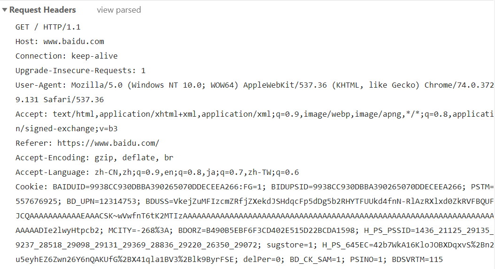
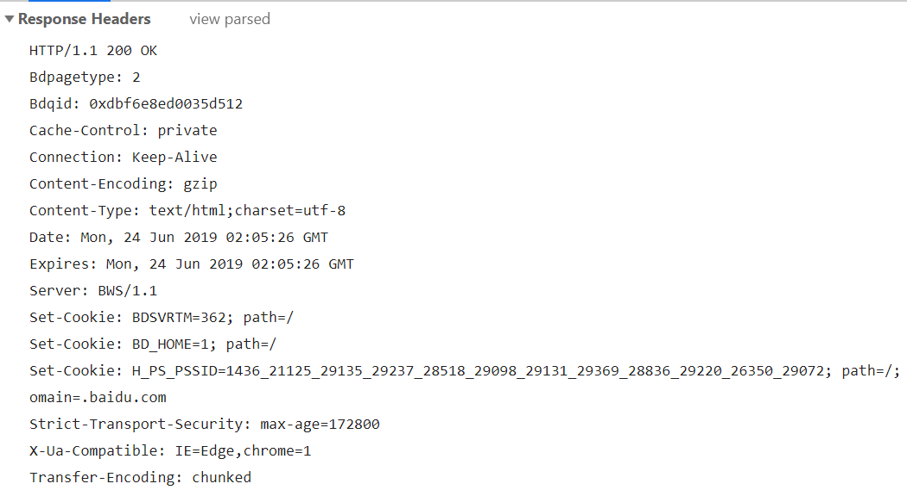

## XML和Tomcat

#### 1. 什么是XML

```
Extensible Markup Language
可拓展标记语言

有什么作用：
	1. 可以用来保存数据
	2. 可以作为一些常见的配置文件
	3. 可以作为小型数据库
	
之前见过的C3P0-config.xml

HTML标签是w3c组织固定，不可以改变的标签
XML可以根据程序员的个人需求，随意更改！！！
```

```xml
<!-- 
<?xml version="1.0" encoding="utf-8"?>
XML文件声明
告知解析器 目前采用的xml版本是 1.0
解析当前XML文件使用的编码集是 utf-8
-->
<?xml version="1.0" encoding="utf-8"?>
<!-- 
在XML文件中，所有标签都可以自定义
 	1. 强制的语法要求，必须成双成对，有头有尾
		<stus></stus> 正确
		<stu></stus> 错误
	2. XML文件中，有且只允许有一个【根节点】 rootElement
	3. XML标签可以带有属性，可以相互嵌套
	4. XML标签名可以自定义，但是要求见名知意
	5. XML文件中的标签名一般都是小写
-->
<stus>
    <student id="001">
        <name>骚磊</name>
        <age>16</age>
        <gender>0</gender>
    </student>
    <student id="002">
        <name>骚杰</name>
        <age>18</age>
        <gender>0</gender>
    </student>
    <student id="003">
        <name>嘉豪</name>
        <age>28</age>
        <gender>1</gender>
    </student>
</stus>
```

#### 2. XML解析


```
SUN公司提供了对于XML文件的解析方式，但是过于繁琐，并且没有任何更新，被人弃用的。
但是我们现在所使用的第三方工具，都是基于SUN原生解析方式来完成的
jaxp jdom
dom4j 好东西！！！ 在Spring，SpringMVC框架使用XML都是采用dom4j 【重点】

核心:
	element.element(String elementName); 获取指定名字的节点类对象
	element.elements(String elementName); 获取指定名字的所有节点类对象，并且返回值是List集合
```

#### 3. Xpath

[W3C XPath教程](http://www.w3school.com.cn/xpath/index.asp)

```java
package com.qfedu.a_xml;

import org.dom4j.Document;
import org.dom4j.DocumentException;
import org.dom4j.Element;
import org.dom4j.io.SAXReader;
import org.dom4j.tree.DefaultAttribute;

import java.io.File;
import java.util.List;

public class Demo2 {
    public static void main(String[] args) throws DocumentException {
        // 1. 获取 XML对应的 Document对象
        Document document = new SAXReader().read(new File("./src/student.xml"));

        // 2. 获取根节点
        Element rootElement = document.getRootElement();

        // 获取所有的Student节点
        List<Element> students = rootElement.selectNodes("student");
        for (Element student : students) {
            System.out.println(student);
        }

        List<Element> address = rootElement.selectNodes("//address");
        for (Element element : address) {
            System.out.println(element);
        }

        List<DefaultAttribute> list = rootElement.selectNodes("//@id");
        for (DefaultAttribute defaultAttribute : list) {
            System.out.println(defaultAttribute.getText());
        }

        List list1 = rootElement.selectNodes("/stus/student[1]");
        System.out.println(list1.get(0));

        List list2 = rootElement.selectNodes("/stus/student[last()]");
        System.out.println(list2.get(0));

        List list3 = rootElement.selectNodes("/stus/student[last() - 1]");
        System.out.println(list3.get(0));

        List list5 = rootElement.selectNodes("//student[age > 18]");
        for (Object o : list5) {
            System.out.println(o);
        }

        System.out.println();
        List<Element> list4 = rootElement.selectNodes("//name | // age");
        for (Element element : list4) {
            System.out.println(element.getText());
        }

    }
}

```

#### 4. Tomcat 【重点】

##### 4.1 Tomcat介绍

```
Tomcat 汤姆猫

服务器软件，安装有服务器软件的电脑，对外提供网络服务，就可以认为是一个服务器！！！
Tomcat 服务器软件是符合 JavaEE 规范的！！！JavaWEB

为什么使用Tomcat
	1. Tomcat支持大部分的JavaEE规范！！！并且可以商用！！！
	2. Tomcat源码公开
	3. 免费

Tomcat 是 Apache 组织基金会维护的一个项目
```

##### 4.2 Tomcat目录介绍

```
bin:
	主要存放的内容有 .jar .bat Windows批处理文件 .sh shell 脚本，主要用于Linux下
	startup.bat/.sh shutdown.bat/sh
conf:
	当前Tomcat服务器对应的配置文件，server.xml 和 web.xml
lib:
	库！！！当前Tomcat服务器执行需要的库文件，以及JavaWEB需要的一些第三方Jar包
	servlet-api.jar
logs:
	Tomcat运行日志目录
temp:
	临时文件目录
webapps: 【重点】
	Web Application Web 应用存放的目录，要求所有的Web项目存放到当前目录下
Work:
	暂时不考虑！！！
```

##### 4.3 启动 Tomcat 服务器

```
在Tomcat路径bin中，找到 startup.bat 双击！！！
启动之后，会出现一个CMD对话框，【切勿关闭】
 
验证，在浏览器中输入: localhost:8080 127.0.0.1:8080 

Tomcat关闭，需要使用 shutdown.bat 双击
所有的CMD对话框全部关闭
```

##### 4.4 Tomcat 启动失败原因

```
1. 不按照规矩操作
	使用startup.bat 启动，使用 shutdown.bat 关闭 

2. Java环境安装存在问题
	a) 没装
	b) JDK环境变量配置有错
	Tomcat运行需要Java支持！！！
```

#### 5. JavaWEB项目目录 【重点】

```
要求在Java中所有的WEB项目，都要按照当前的WEB目录结构来完成

--| WEBProject 当前Web Application的根目录，目录名就是你项目的名字
可以在WEBProject存放静态资源，利用HTML，CSS，JS，img, video...
----| META-INF 不用操心，目前不用考虑
----| WEB-INF 目录的所有内容都不能通过浏览器 URL目录结构方式来访问，需要通过一些配置来完成
    --| classes 存放Java文件对应的.class 字节码文件，提供给Tomcat服务器运行执行
    --| lib 当前项目执行需要的第三方Jar目录
    --| web.xml 当前整个WEB项目的配置文件
```

## HTTP协议和Servlet基本使用

#### 1. HTTP协议

```
1990年推出
专门对于网络数据传输指定的一个协议。
超文本传输协议

支持MIME数据格式，视频，音频，文本...

HTTP区别客户端和服务器
	1. 简单快捷
	2. 灵活
	3. 无连接
	4. 无状态 3G QQ

URL
	统一资源定位符
	http://www.baidu.com?s=java
	HTTP表示采用的协议 
		其他常见协议 jdbc https ftp file
	www.badu.com
		域名 ==> 百度的服务器IP地址，域名解析
	?s=java 
		? 之后是参数，参数名s 值为java 键值对形式！！！		
```

#### 2. HTTP消息头

.png)



##### 2.1 HTTP请求头

```
Request URL	请求地址
Request Method 请求方式
Status Code 状态码

GET / HTTP/1.1 Get请求，遵从 HTTP 1.1协议
accept 当前支持的数据类型 ，文本类型，视频类型，压缩包类型
accept-encoding 支持的文件类型类型
accept-language 支持的字符集
Cookie 会话控制【重点】
```



##### 2.2 HTTP响应头

```
浏览器发送请求到服务器，服务器对于当前请求的响应

HTTP/1.1 200 OK
	响应使用的协议是HTTP协议，200状态码 正常状态

Content-Type:
	text/html;charset=utf-8
	对应Servlet中的方法
		response.setContentType("text/html;charset=utf-8");
set-cookie 给予浏览器Cookie信息，是会话控制的一部分【重点】
```

#### 3. Servlet【重点】

##### 3.1 Servlet简介

```
servlet ==> Server Applet
Java的服务器小程序，也是JavaWEB中非常重要的一环，主要功能是完成HTML和Java后台代码之间的关系

Servlet程序是需要运行在Java对应的WEB服务器上，也就是符合JavaEE规范的服务器上。Tomcat
Servlet程序同时也要符合HTTP协议

Servlet的核心类或者说核心接口
	javax.servlet 和 javax.servlet.http 这两个包下
	javax.servlet.ServerException 服务器异常
	javax.servlet.http.HttpServlet	
	javax.servlet.http.HttpServletRequest	
	javax.servlet.http.HttpServletResponse
	javax.servlet.http.Cookie
	javax.servlet.http.Session
```

##### 3.2 Servlet初识，创建一个Java WEB项目

##### 参考图片在img文件夹下

```java
package com.qfedu.a_servlet;

import javax.servlet.ServletException;
import javax.servlet.annotation.WebServlet;
import javax.servlet.http.HttpServlet;
import javax.servlet.http.HttpServletRequest;
import javax.servlet.http.HttpServletResponse;
import java.io.IOException;

/**
 * http://localhost:8080/Day29_SL/HelloServlet
 * @author Anonymous
 */
@WebServlet("/hs.do")
public class HelloServlet extends HttpServlet {
    /**
     * 处理 Post请求
     * @param request
     * @param response
     * @throws ServletException
     * @throws IOException
     */
    @Override
    protected void doPost(HttpServletRequest request, HttpServletResponse response) throws ServletException, IOException {
        doGet(request, response);
    }

    /**
     * 处理 Get请求
     * @param request
     * @param response
     * @throws ServletException
     * @throws IOException
     */
    @Override
    protected void doGet(HttpServletRequest request, HttpServletResponse response) throws ServletException, IOException {
        response.getWriter().append("<font color='red' size='7'>Hello Servlet</font><br>");
        response.getWriter().append("<font color='red' size='7'>Hello Servlet</font><br>");
        response.getWriter().append("<font color='red' size='7'>Hello Servlet</font><br>");
        response.getWriter().append("<font color='red' size='7'>Hello Servlet</font><br>");
        response.getWriter().append("<font color='red' size='7'>Hello Servlet</font><br>");
    }
}

```

##### 3.3 Servlet核心接口和类

```java
Servlet接口
    void init(ServletConfig var1) throws ServletException; 
		【知晓】使用ServletConfig类对象初始化当前Servlet程序
    ServletConfig getServletConfig(); 
		【必须会】获取当前ServletConfig对象，也就是Servlet配置对象
    void service(ServletRequest var1, ServletResponse var2) throws ServletException, IOException; 
		【知晓】Servlet的服务方法，你可以认为doGet 和 doPost是当前service一种实现方式
    String getServletInfo(); 
		【了解】返回值是字符串的内容，除非是需要保存在数据库内容，其他的...    	
    void destroy(); 
		【知晓】Servlet程序销毁方法！！！
```

```java
GenericServlet 抽象类 implements Servlet
在这个类内，实现了init和destroy方法，我们自定义的Servlet程序类，不需要完成这些方法，简化代码的书写压力
```

```java
HttpServlet 抽象类 extends GenericServlet
一般情况下，我们都是集成HttpServlet类来创建Servlet程序，在HttpServlet中，完成了一些了doXXX
比较常用的是doGet和doPost
我们需要对应doGet和doPost进行重写

核心转换方法都是service方法
```

##### 3.4 三种创建Servlet的方式 【面试题】

###### 3.4.1 自定义Servlet类遵从 Servlet接口

```java
package com.qfedu.a_servlet;

import javax.servlet.*;
import javax.servlet.annotation.WebServlet;
import java.io.IOException;

@WebServlet("/TestServlet1")
public class TestServlet1 implements Servlet {

    @Override
    public void init(ServletConfig servletConfig) throws ServletException {
        System.out.println("init方法");
    }

    @Override
    public ServletConfig getServletConfig() {
        System.out.println("getServletConfig");
        return null;
    }

    @Override
    public void service(ServletRequest servletRequest, ServletResponse servletResponse) throws ServletException, IOException {
        System.out.println("service方法");
        servletResponse.setContentType("text/html;charset=utf-8");
        servletResponse.getWriter().append("你好");
    }

    @Override
    public String getServletInfo() {
        return null;
    }

    @Override
    public void destroy() {
        System.out.println("destroy方法");
    }
}
```

###### 3.4.2 自定义Servlet类继承**GenericServlet**

```java
package com.qfedu.a_servlet;

import javax.servlet.GenericServlet;
import javax.servlet.ServletException;
import javax.servlet.ServletRequest;
import javax.servlet.ServletResponse;
import javax.servlet.annotation.WebServlet;
import java.io.IOException;

@WebServlet("/TestServlet2")
public class TestServlet2 extends GenericServlet {
    @Override
    public void service(ServletRequest servletRequest, ServletResponse servletResponse) throws ServletException, IOException {
        System.out.println("service方法");
        servletResponse.setContentType("text/html;charset=utf-8");
        servletResponse.getWriter().append("你好");
    }
}
```

###### 3.4.3 自定义Servlet类继承HttpServlet

```java
package com.qfedu.a_servlet;

import javax.servlet.ServletException;
import javax.servlet.annotation.WebServlet;
import javax.servlet.http.HttpServlet;
import javax.servlet.http.HttpServletRequest;
import javax.servlet.http.HttpServletResponse;
import java.io.IOException;

@WebServlet("/TestServlet3")
public class TestServlet3 extends HttpServlet {
    @Override
    protected void doGet(HttpServletRequest req, HttpServletResponse resp) throws ServletException, IOException {
        doPost(req, resp);
    }

    @Override
    protected void doPost(HttpServletRequest req, HttpServletResponse resp) throws ServletException, IOException {
        System.out.println("doPost");
        resp.setContentType("text/html;charset=utf-8");
        resp.getWriter().append("你好");
    }
}
```

###### 3.4.4 三种方式的优缺点

```
最好的方式是继承HttpServlet
	1. 可以减少对于其他方法的处理要求，可以让GenericServlet还是HttpServlet可以帮助我们处理一些对于业务逻辑影响不大的方法，init，destroy，构造方法
	2. 可以根据Http请求方式分门别类的处理方法
		doPost doGet
```

##### 3.5 Servlet的两种配置方式

###### 3.5.1 web.xml配置方式，通用于所有的Servlet版本
```java
package com.qfedu.b_servlet;

import javax.servlet.ServletConfig;
import javax.servlet.ServletException;
import javax.servlet.http.HttpServlet;
import javax.servlet.http.HttpServletRequest;
import javax.servlet.http.HttpServletResponse;
import java.io.IOException;
import java.io.PrintWriter;

public class WebXMLServlet extends HttpServlet {
    public WebXMLServlet() {
        System.out.println("WebXMLSerlvet Constructor");
    }

    @Override
    public void init(ServletConfig config) throws ServletException {
        super.init(config);
        System.out.println("init");
    }

    @Override
    protected void doGet(HttpServletRequest req, HttpServletResponse resp) throws ServletException, IOException {
        doPost(req, resp);
    }

    @Override
    protected void doPost(HttpServletRequest req, HttpServletResponse resp) throws ServletException, IOException {
        resp.setContentType("text/html;charset=utf-8");
        PrintWriter writer = resp.getWriter();

        writer.append("代码千万行<br>");
        writer.append("规范第一行<br>");
        writer.append("代码不规范<br>");
        writer.append("码农两行泪<br>");
    }
}
```

```xml
<!-- web.xml配置文件 -->
<?xml version="1.0" encoding="UTF-8"?>
<web-app xmlns="http://xmlns.jcp.org/xml/ns/javaee"
         xmlns:xsi="http://www.w3.org/2001/XMLSchema-instance"
         xsi:schemaLocation="http://xmlns.jcp.org/xml/ns/javaee http://xmlns.jcp.org/xml/ns/javaee/web-app_3_1.xsd"
         version="3.1">
    <!-- Servlet 配置 -->
    <servlet>
        <display-name>WebXMLServlet</display-name>
        <!-- Servlet-name 要和 Servlet-mapping对应 -->
        <servlet-name>WebXMLServlet</servlet-name>
        <!-- Servlet程序对应的类 -->
        <servlet-class>com.qfedu.b_servlet.WebXMLServlet</servlet-class>
        <!-- Servlet程序，服务器启动加载 -->
        <load-on-startup>1</load-on-startup>
    </servlet>
    <!-- Servlet程序映射   -->
    <servlet-mapping>
        <!-- Servlet-name 要和 Servlet标签内的 Servlet-name一致 -->
        <servlet-name>WebXMLServlet</servlet-name>
        <!-- URL对应的匹配规则 -->
        <url-pattern>/WebXMLServlet</url-pattern>
        <url-pattern>/webxml.do</url-pattern>
    </servlet-mapping>
</web-app>
```
###### 3.5.2 注解方式配置Servlet，从Servlet 3.0版本之后使用

|    属性名    |      类型      |                           属性描述                           |
| :----------: | :------------: | :----------------------------------------------------------: |
|     name     |     String     |             Servlet的名字，对应servlet-name标签              |
|    value     |     String     | Servlet程序对于的url，对应url-pattern标签，但是不能和urlPatterns共同存在 |
| urlPatterns  |    String[]    | Servlet程序对于的url组合，对应url-pattern标签，可以存放对应当前servlet URL对应的名字【重点】 |
| loadOnStarUp |      int       |        Serlvet程序的加载过程，是否服务器启动自动加载         |
|  initParams  | WebInitParam[] |    Servlet程序的初始化参数，数据类型是键值对方式【重点】     |
| displayName  |     String     |            Serlvet显式的名字，对应displayname标签            |
| description  |     String     |            Servlet的描述信息，对应description标签            |

```java
package com.qfedu.b_servlet;

import javax.servlet.ServletConfig;
import javax.servlet.ServletException;
import javax.servlet.annotation.WebServlet;
import javax.servlet.http.HttpServlet;
import javax.servlet.http.HttpServletRequest;
import javax.servlet.http.HttpServletResponse;
import java.io.IOException;
import java.io.PrintWriter;

/**
 * @author Anonymous
 */
@WebServlet(name = "AnnotationServlet",
        urlPatterns = {"/AnnotationServlet", "/as.do", "/as.action"},
        loadOnStartup = 1)
public class AnnotationServlet extends HttpServlet {
    public AnnotationServlet() {
        System.out.println("AnnotationServlet Constructor");
    }

    @Override
    public void init(ServletConfig config) throws ServletException {
        super.init(config);
        System.out.println("init Method");
    }

    @Override
    protected void doPost(HttpServletRequest req, HttpServletResponse resp) throws ServletException, IOException {
        resp.setContentType("text/html;charset=utf-8");
        PrintWriter writer = resp.getWriter();

        writer.append("代码千万行<br>");
        writer.append("规范第一行<br>");
        writer.append("代码不规范<br>");
        writer.append("码农两行泪<br>");
    }

    @Override
    protected void doGet(HttpServletRequest req, HttpServletResponse resp) throws ServletException, IOException {
        doPost(req, resp);
    }
}
```

##### 3.5 Servlet生命周期

```
整个Servlet应用程序执行的过程
	Constructor
	init
	service
	destroy

阶段1:
	servlet类对象实例化，创建当前Servlet程序对应的类对象，提供给Tomcat服务器使用。所有的Servlet程序，都是在符合JavaEE规范的服务器上执行的
	Constructor

阶段2:
	servlet类对象初始化，使用init方法，通过ServletConfig对象的里面存储参数，初始化Servlet类对象

阶段3:
	当前servlet对外提供服务，service，使用的方法大部分都是doGet和doPost

阶段4:
	servlet销毁过程，可以主动申请销毁servlet程序，或者是在服务器关闭状态下关闭servlet，使用的方法是destroy
```

```java
package com.qfedu.c_life;

import javax.servlet.ServletConfig;
import javax.servlet.ServletException;
import javax.servlet.annotation.WebServlet;
import javax.servlet.http.HttpServlet;
import javax.servlet.http.HttpServletRequest;
import javax.servlet.http.HttpServletResponse;
import java.io.IOException;

/**
 * @author Anonymous
 */
@WebServlet(name = "LifeServlet",
        value = "/LifeServlet",
        loadOnStartup = 1)
public class LifeServlet extends HttpServlet {

    /**
     * 构造方法，用于提供给 Tomcat服务器实例化当前Servlet程序
     */
    public LifeServlet() {
        System.out.println("LifeServlet Constructor Called");
    }

    @Override
    public void init(ServletConfig config) throws ServletException {
        super.init(config);
        System.out.println("init method Called");
    }

    @Override
    protected void service(HttpServletRequest req, HttpServletResponse resp) throws ServletException, IOException {
        resp.getWriter().append("Hello shi wo");
        System.out.println("service method Called");
    }

    @Override
    public void destroy() {
        super.destroy();
        System.out.println("destroy method Called");
    }
}
```

##### 3.6 获取请求参数

```html
<!DOCTYPE html>
<html lang="en">
<head>
    <meta charset="UTF-8">
    <title>登陆页面</title>
</head>
<body>
<form action="LoginServlet" method="get">
<table>
    <tr>
        <td>姓名</td>
        <td><input type="text" name="user" ></td>
    </tr>
    <tr>
        <td>密码</td>
        <td><input type="password" name="password"></td>
    </tr>
    <tr>
        <td><input type="reset" value="重置"></td>
        <td><input type="submit" value="提交"></td>
    </tr>
</table>
</form>
</body>
</html>
```

```java
package com.qfedu.d_parameter;

import javax.servlet.ServletException;
import javax.servlet.annotation.WebServlet;
import javax.servlet.http.HttpServlet;
import javax.servlet.http.HttpServletRequest;
import javax.servlet.http.HttpServletResponse;
import java.io.IOException;

@WebServlet(name = "LoginServlet", value = "/LoginServlet")
public class LoginServlet extends HttpServlet {
    @Override
    protected void doPost(HttpServletRequest request, HttpServletResponse response) throws ServletException, IOException {
        doGet(request, response);
    }

    @Override
    protected void doGet(HttpServletRequest request, HttpServletResponse response) throws ServletException, IOException {
        request.setCharacterEncoding("utf-8");
        /*
        HTML页面中的 input标签发送的数据，都在 HttpServletRequest对象中
        通过 HttpServletRequest对象获取对应的参数，获取的方式是通过参数的
        名字获取对应的值，获取到的数据都是 String类型
        */
        // input标签user对应的值
        String user = request.getParameter("user");
        // input标签password对应值
        String password = request.getParameter("password");

        System.out.println(user + ":" + password);
    }
}
```

#### 4. 从前端发送数据到Servlet保存到MySQL中

```html
<!DOCTYPE html>
<html lang="en">
<head>
    <meta charset="UTF-8">
    <title>注册</title>
</head>
<body>
<form action="RegisterServlet" method="post">
    <table>
        <tr>
            <td>姓名</td>
            <td><input type="text" name="user" ></td>
        </tr>
        <tr>
            <td>密码</td>
            <td><input type="password" name="password"></td>
        </tr>
        <tr>
            <td><input type="reset" value="重置"></td>
            <td><input type="submit" value="提交"></td>
        </tr>
    </table>
</form>
</body>
</html>
```

```java
package com.qfedu.e_project;

import javax.servlet.ServletException;
import javax.servlet.annotation.WebServlet;
import javax.servlet.http.HttpServlet;
import javax.servlet.http.HttpServletRequest;
import javax.servlet.http.HttpServletResponse;
import java.io.IOException;
import java.sql.SQLException;

@WebServlet("/RegisterServlet")
public class RegisterServlet extends HttpServlet {
    @Override
    protected void doGet(HttpServletRequest req, HttpServletResponse resp) throws ServletException, IOException {
        doPost(req, resp);
    }

    @Override
    protected void doPost(HttpServletRequest req, HttpServletResponse resp) throws ServletException, IOException {
        req.setCharacterEncoding("utf-8");

        String user = req.getParameter("user");
        String password = req.getParameter("password");

        Object[] parameters = {user, password};

        try {
            PersonDao.getInstance().addPerson(parameters);
        } catch (SQLException e) {
            System.out.println("SQL异常");
        }
    }
}
```

```java
package com.qfedu.e_project;

import util.BaseDao;

import java.sql.SQLException;

public class PersonDao extends BaseDao {

    private static PersonDao pd = null;

    private PersonDao() {}

    public static PersonDao getInstance() {
        synchronized (PersonDao.class) {
            if (null == pd) {
                pd = new PersonDao();
            }
        }

        return pd;
    }

    public int addPerson(Object[] parameters) throws SQLException {
        String sql = "insert into day29.person(user, password) values(?, ?)";

        return super.update(sql, parameters);
    }
}
```

