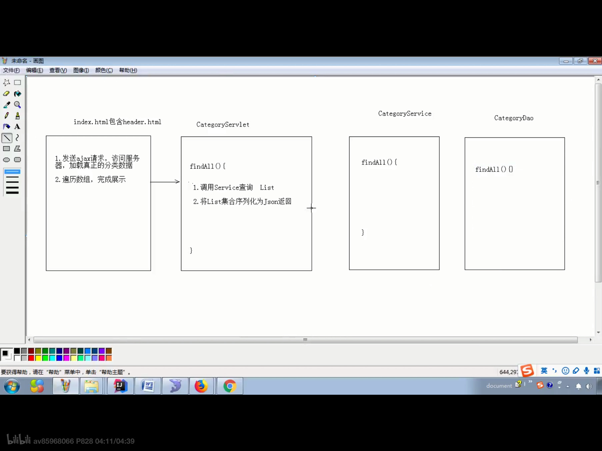

## 分页查询

```js
/*
                1.为了达到向百度一样的 显示十个 然后前五后四 前面不够5个 后面补齐10个 后面不足四个 前面补齐十个
                */
                //设计 begin 和 end
                //1.当总页数小于10时
                var begin;
                var end;
                if (data.totalPage < 10){
                    begin = 1;
                    end = data.totalPage;
                } else {
                    //当页数大于十
                    begin = data.currentPage - 5;
                    end = data.currentPage + 4;
                    //当前面不足5个时，即begin < 1
                    if (begin < 1){
                        //显示完10个
                        begin = 1;
                        end = begin + 9;
                    }
                    //到最后一页 后面不够4个时 即 end = totalPage
                    if (end > data.totalPage){
                        end = data.totalPage;
                        begin = end - 9;
                    }
                }
```

```js
//页码：
for (var i = begin; i <= end; i++){
                    //判断当前页是否等于i
                    var list;
                    //赋予class属性
                    if (data.currentPage === i){
                        list = '<li class="curPage" onclick="load('+cid+','+i+');"><a href="javascript:void(0);">'+i+'</a></li>';
                    }
                    else {
                        list = '<li onclick="load('+cid+','+i+');"><a href="javascript:void(0);">'+i+'</a></li>';
                    }
                    lists += list;
                }
```

```js
//内容
var routlist = "";
                for (var i = 0; i < data.list.length; i++) {
                    var rout = data.list[i];
                    routlist += '<li><div class="img"></div>';
                    routlist += '<div class="text1"><p>'+rout.rname+'</p><br/>';
                    routlist += '<p>'+rout.routeIntroduce+'</p></div>';
                    routlist += '<div class="price"><p class="price_num"><span>&yen;</span><span>'+rout.price+'</span><span>起</span></p>'
                    //rout.rid为了跳转详情页面传递参数
                   routlist += '<p><a href="route_detail.html?rid='+rout.rid+'">查看详情</a></p></div></li>';
                }
                $("#routlist").html(routlist);
```

能够实现查询功能：

```js
/*
首先将之前的数据库改为模糊查询 加上rname 进行模糊查询--代码就是拼接和参数List
然后将前台的load 代码加上一个rname参数并将请求json加上rname
注意一点当有rname时 一定要将其从url解码到utf-8
*/
//一定要判断null 否则将会把null转成string传回后台 会出错
 if (rname != null){
                rname = window.decodeURIComponent(rname);
            }else {
                rname = "";
            }
/*
注意 ：
	1.封装了一个getParameter()方法，能直接获取到url中的？后的参数，引入js可以直接调用
	2.由于搜索在header.html中，所以要在header.html中获得搜索框的内容并由 local.href转发到route_list,html中，然后在route_list.html中进行load()
	3.添加了load()rname 参数时 不要忘记 翻页和页码也要加上rname 
*/
```

## 查看详情


```
主要是拼接字符串
```


# 注意：

##  异步请求不能用response.sendRedirect重定向


